*NOTE:* This file is a template that you can use to create the README for your project. The *TODO* comments below will highlight the information you should be sure to include.

# Udacity Azure Machine Learning Project

The data is related with direct marketing campaigns of a Portuguese banking institution. With this project I am trying to predict whether a customer subscribe a term deposit or not.

This project is all about creating an optimized model from scratch by using powerful feature of Azure Auto ML and deploy it so that it can be used in real life scenarios. It is carried out by two different methods: using Azure ML studio and using Pipelines.

In the first part of project I used Azure ML Studio. The configuration  is pretty straightforward and actually only task type is selected as classification. Other than that, all settings are left as default options. After the AutoML experiment successfully run, based on the accuracy metric the best model is selected among around 100 models. The next step is to deploy. Again it is quite easy to deploy. We just give name, write a quick description and select compute type, and that’s all! Here we do two additional things to our deployed model. First one, I enabled application insights to so that I can make use of powerful logs and I can reach azure portal for my deployed model. For example, if there is failed request I can get information about it. The other thing is swagger documentation. By using swagger, a powerful document is prepared automatically. The most important part of this document is that it explains how to interact our model API. For example, it gives a sample data point.

The second of the project is all about doing the same things by using pipelines. Pipelines are great way to automate workflow and thanks to this project we carried out every steps in the previous part (except swagger documentation and enabling insights) by using pipelines. Also, I interacted with published pipeline through its rest endpoint by submitting HTTP post request.

## Architectural Diagram
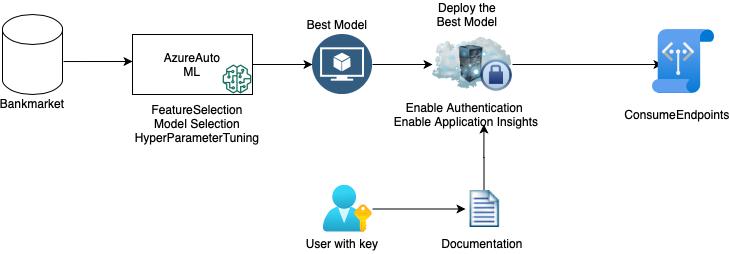

## Key Steps

(Step 1: Authentication--> Skipped)

#### Step 2:Automated ML Experiment
Registered Datasets in ML Stuido showing that Bankmarketting dataset available:
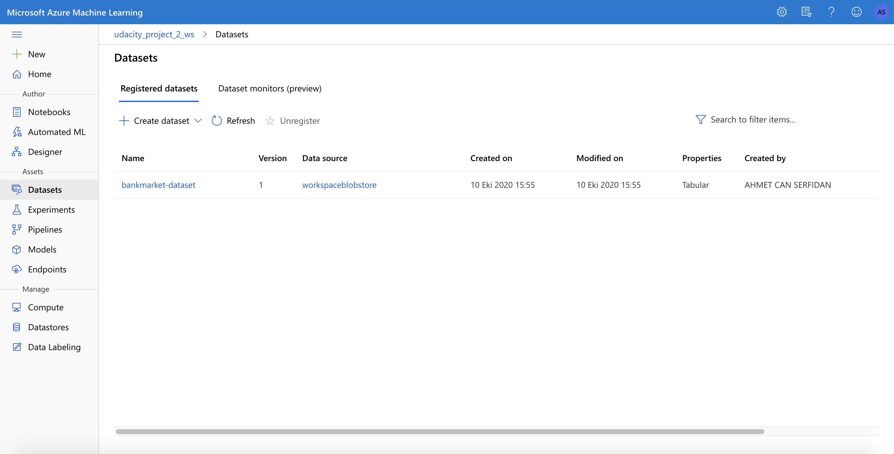

AutoML experiment is completed:
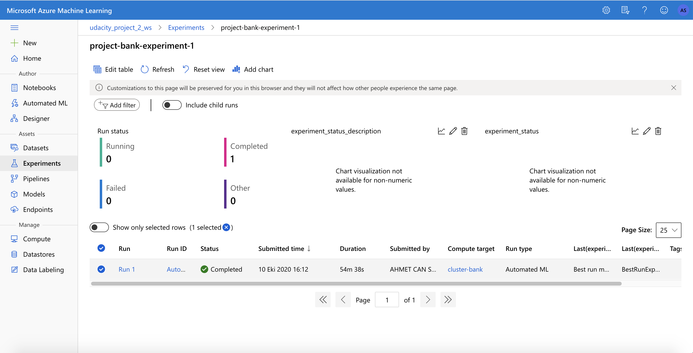

Best Model:
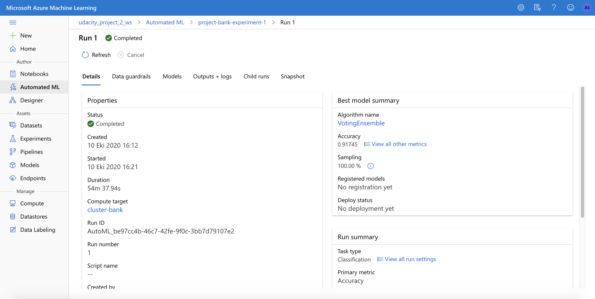

#### Step 3:Deploy the Best Model

Best Model Deployed:
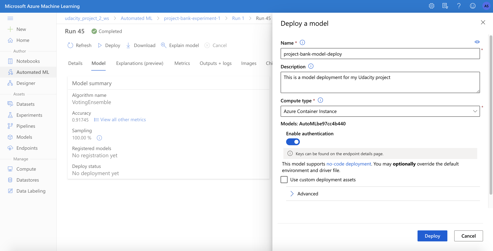

#### Step 4:Enable Application Insights

Application insights is enabled:
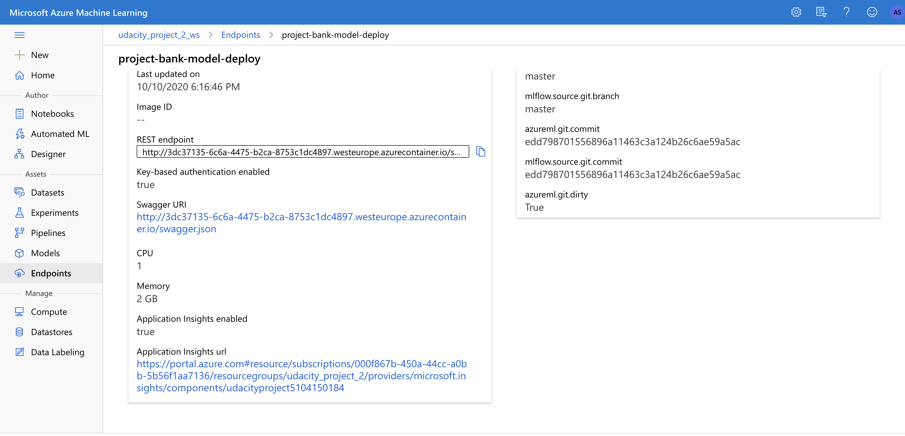

Logs:
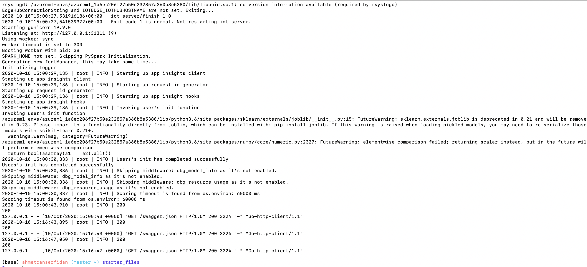

#### Step 5:Swagger Documentation

Swagger Documentation:
1)
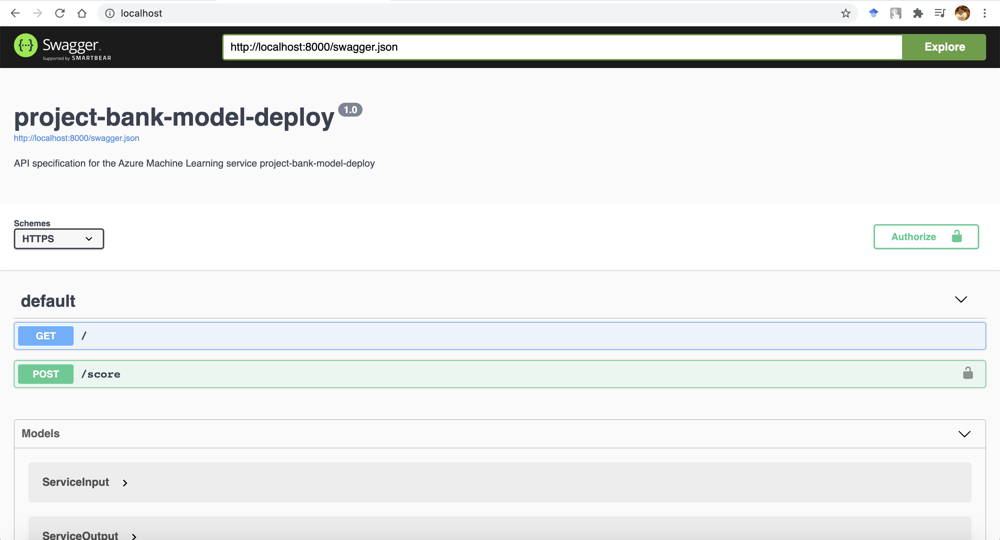

2)
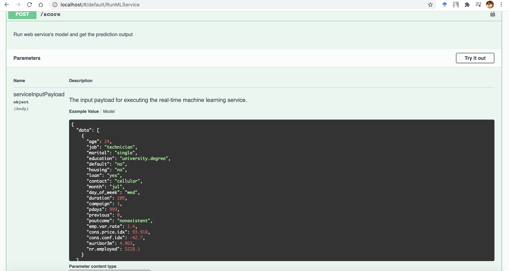

#### Step 6:Consume Model Endpoint

Endpoint Result Test:
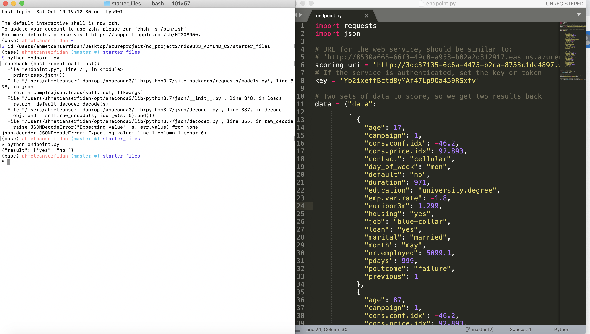

#### Step 7:Create, Publish and Consume Pipeline

Pipeline created:
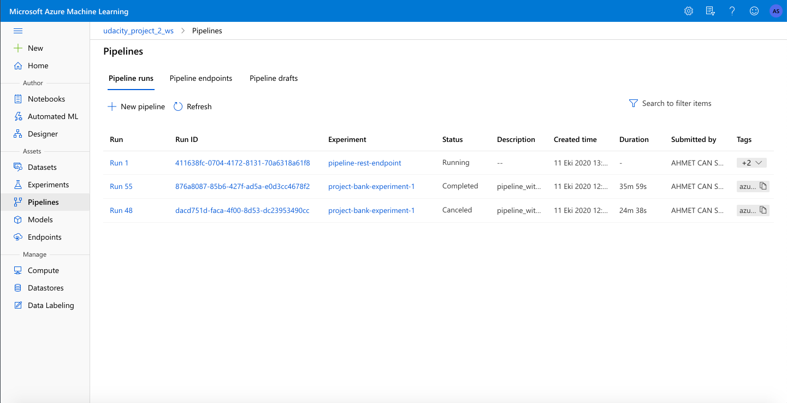

Pipeline endpoint:
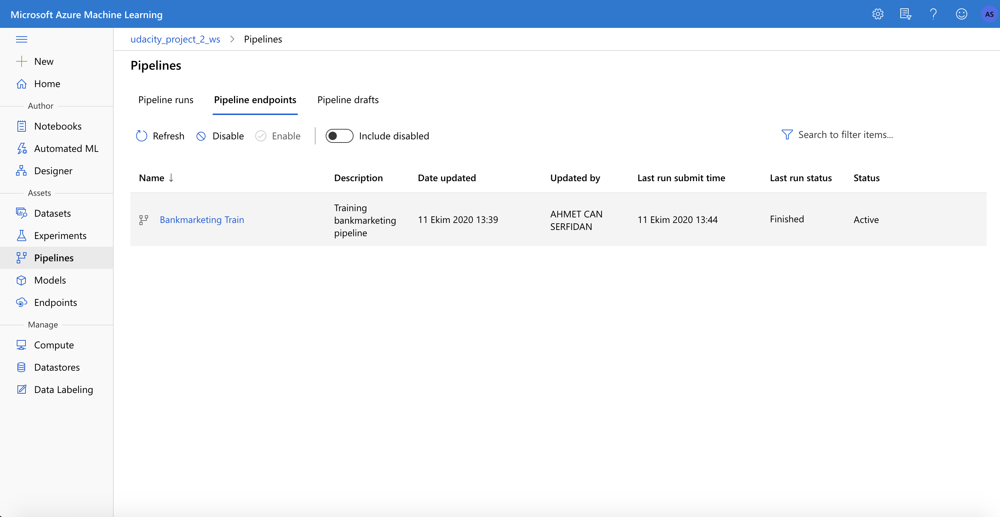

The bankmarketting dataset with AutoMl module:
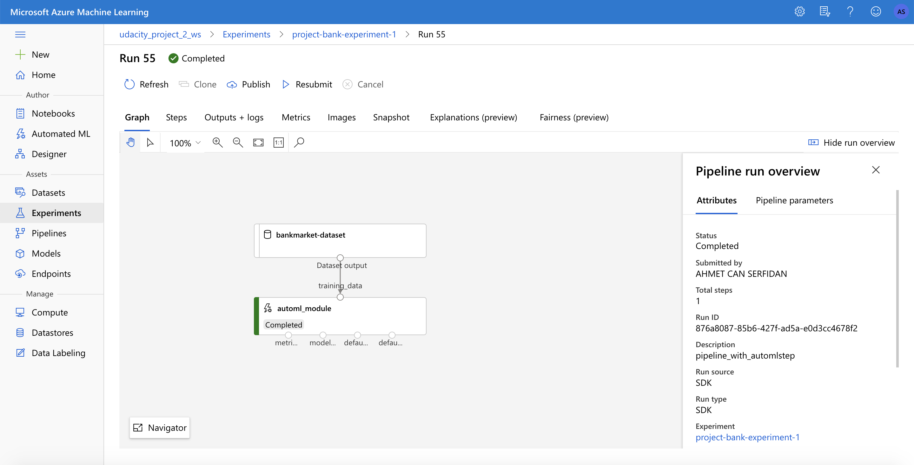

Rest Endpoint and Status:
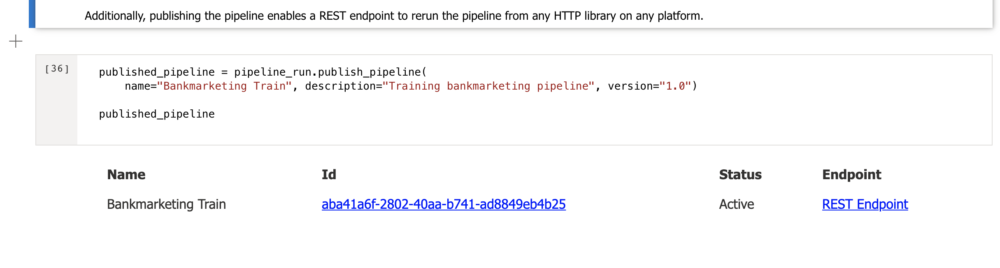

RundDetails Widget:
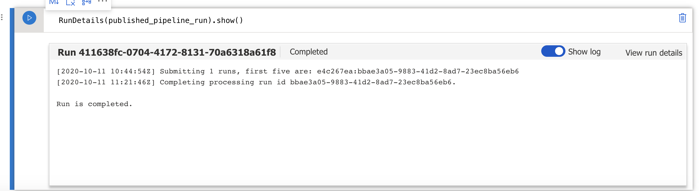

Scheduled Run status in ML studio:
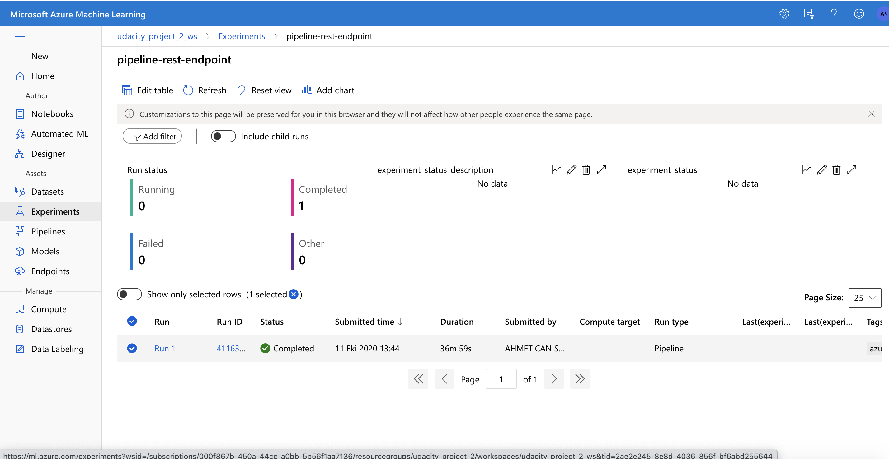

## Screen Recording
video URL: https://youtu.be/6hlwj3KG84M

## Standout Suggestions
*TODO (Optional):* This is where you can provide information about any standout suggestions that you have attempted.
