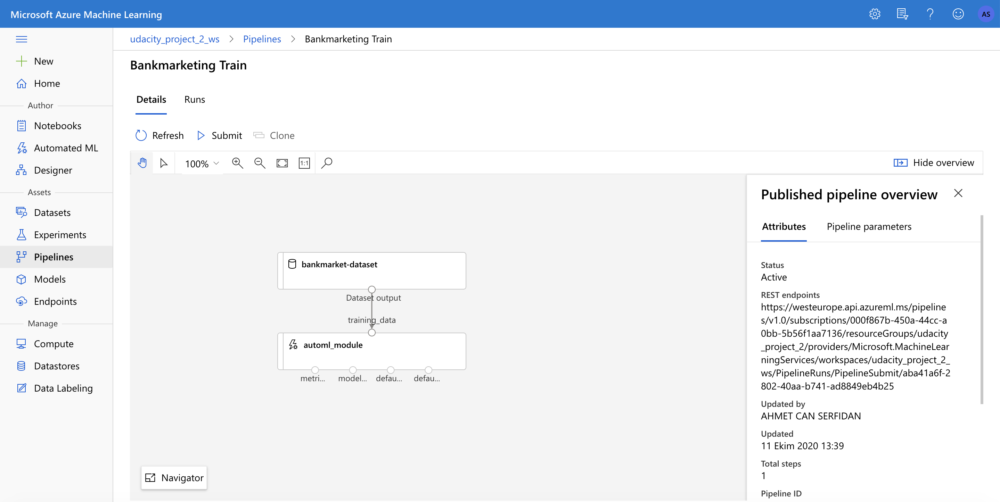

# Udacity Azure Machine Learning Project

The data is related with direct marketing campaigns of a Portuguese banking institution. With this project I am trying to predict whether a customer subscribe a term deposit or not.

This project is all about creating an optimized model from scratch by using powerful feature of Azure Auto ML and deploy it so that it can be used in real life scenarios. It is carried out by two different methods: using Azure ML studio and using Pipelines.

In the first part of project I used Azure ML Studio to create and deploy model. The AutoML configuration  is pretty straightforward and actually only task type is selected as classification. After the AutoML experiment successfully run, based on the accuracy metric the best model is selected among around 100 models. The next step is to deploy. In addition to custom deployment, I enabled application insights to so that I can make use of powerful logs and I can reach azure portal for my deployed model. For example, if there is failed request I can get information about it. The other thing is swagger documentation. The most important part of this document is that it explains how to interact our model API and all of this document is prepared automatically.

The second part of the project is all about doing the same things by using pipelines. Pipelines are great way to automate workflow and thanks to this project we carried out every steps in the previous part (except swagger documentation and enabling insights) by using pipelines. Also, I interacted with published pipeline through its rest endpoint by submitting HTTP post request.

## Architectural Diagram

## How to imporve this project in the future:
Maybe we can add more data to the model, or we can add more columns. Also we can make new columns with existing ones with future engineering, not future selection. As it is discussed in the lectures, thanks to AutoML, engineers/scientist play more role in modeling process. We have to apply our domain knowledge and obtain better results. Also for this experiment, I did not want to spend too much money since I am working on my own azure account. However, I should have definitely tried at least 50 models.

## Key Steps

(Step 1: Authentication--> Skipped)

#### Step 2:Automated ML Experiment
Registered Datasets in ML Stuido showing that Bankmarketting dataset available:

The data is related with direct marketing campaigns of a Portuguese banking institution. The marketing campaigns were based on phone calls. Often, more than one contact to the same client was required, in order to access if the product (bank term deposit) would be ('yes') or not ('no') subscribed. We are trying to predict whether the client subscribed a term deposit or not. If yes it is labeled as 'y', otherwise 'n'. To predict this, we have 20 explanatory features which includes age, job, marital, education and so on.

AutoML experiment is completed:
I used default options of Azure AutoML algortihm. It is quite easy to use tool. All feature selection, hypertuning,etc are carried out by itself. This saves lots of time.

Best Model:

Our best performing model is: VotingEnsemble Based on this model most impactful features are: duration and emp.var.rate

#### Step 3:Deploy the Best Model

Best Model Deployed:

Similar to obtaining best model, deploying it also is quite easy. After selecting the best model, I just follow default options of deploy process. I selected compute type as Azure Container Instance and enabled key authentication.

#### Step 4:Enable Application Insights

Application insights is enabled:

Logs:

Thanks to enabling insights I can reach logs easily and analyze information like when there is a failure request etc.

#### Step 5:Swagger Documentation

Swagger Documentation:
1)

2)

This is another proof that Azure ML platform makes developer lives easier. Thanks to swagger documentation, Model API document is created automatically (I just needed to follow some simple steps). After that, if anyone wants to interact my API, he can refer to this powerful document.

#### Step 6:Consume Model Endpoint

Endpoint Result Test:

#### Step 7:Create, Publish and Consume Pipeline

Pipelines are great way to automate workflow. Before this step, all of steps are carried out in Azure ML Studio. From now on, I am working inside Azure SDK pyton notebook.
Pipeline created:

Pipeline endpoint:

The bankmarketting dataset with AutoMl module:

Before this step, everyting is exactly same with the previous steps. However thanks to pipeline, I can congifure setting easily. Thats is the major difference.
Now I am gıing to interact with the published pipeline thorugh its rest Endpoint. This is the major advantage of using pipeline. Anyone can submit an HTTP post request to interact with a pipeline endpoint.
Rest Endpoint and Status:

RundDetails Widget:

Scheduled Run status in ML studio:

## Screen Recording
video URL: https://youtu.be/6hlwj3KG84M

